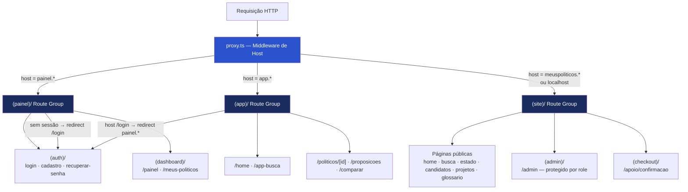
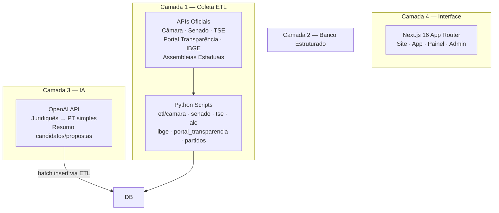
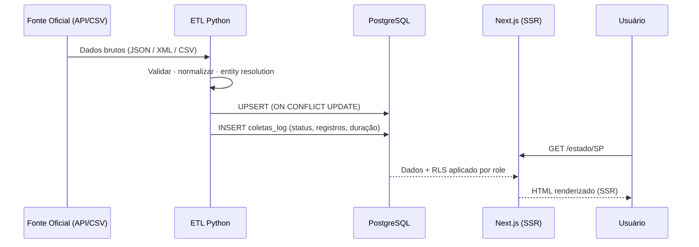

# Arquitetura — Meus Políticos

> **Nota de transição:** as secoes abaixo descrevem a arquitetura ativa/legada
> Logto e mantem PostgreSQL VPS como banco principal. Ver
> `docs/auth/AUTH_MIGRATION_LOGTO.md` e
> `docs/adr/ADR-001-logto-as-identity-provider.md`.

## Status Atual da Plataforma

| Eixo | Status |
|---|---|
| Banco | PostgreSQL VPS ativo |
| Público | Migrado para PostgreSQL direto |
| Painel/Admin | Aguardando Logto |
| Pagamentos | Stripe removido; InfinitePay ativo |

## 1. Tipo de Aplicação

**Plataforma multi-produto** servida por um único deploy Next.js diferenciado por host (subdomínio). Três produtos distintos — site público, app analítico e painel do usuário — compartilham código, banco de dados e autenticação sem múltiplos deploys.

| Produto | Domínio (produção) | Domínio (dev local) | Audiência |
|---|---|---|---|
| Site Público | `meuspoliticos.com.br` | `localhost:3000` | Cidadão geral |
| App Analítico | `app.meuspoliticos.com.br` | `app.localhost:3000` | Usuário avançado / imprensa |
| Painel do Usuário | `painel.meuspoliticos.com.br` | `painel.localhost:3000` | Usuário autenticado |
| Painel Interno | `meuspoliticos.com.br/admin` | `localhost:3000/admin` | Equipe interna (role: admin) |

---

## 2. Padrão Arquitetural

| Decisão | Escolha | Justificativa |
|---|---|---|
| Framework | Next.js 16 App Router | SSR, ISR, Route Handlers e Server Components em um único runtime |
| Route groups | `(site)/`, `(app)/`, `(painel)/`, `(admin)/`, `(checkout)/` | Separação de produtos sem múltiplos deploys |
| Roteamento multi-produto | `proxy.ts` (middleware por host) | Diferencia produtos pelo header `Host` da requisição |
| ETL | Scripts Python independentes | Acesso direto ao PostgreSQL; desacoplado do frontend |
| Estado global | Nenhum (sem Redux/Zustand) | Server Components para dados; `useState` local para UI |

---

### Roadmap de identidade

| Horizonte | Arquitetura |
|---|---|

O roadmap completo esta em `docs/auth/AUTH_MIGRATION_LOGTO.md`.

---

## 3. Diagrama de Subdomínios



---

## 4. Diagrama de Camadas do Sistema



---

## 5. Fluxo de Dados (Ciclo completo)



---

## 6. Mapeamento Completo de Rotas

### (site)/ — Site Público

**Dados e conteúdo:**

| Rota | Status | Notas |
|---|---|---|
| `/` | ✅ Ativo | Home com busca e mapa |
| `/busca` | ✅ Ativo | Resultados com filtros |
| `/estado` | ✅ Ativo | Seleção de estado |
| `/estado/[sigla]` | ✅ Ativo | Representantes do estado |
| `/estado/[sigla]/assembleia` | ✅ Ativo | Deputados estaduais |
| `/estado/[sigla]/assembleia/[slug]` | ✅ Ativo | Perfil do dep. estadual |
| `/candidatos-2026` | ✅ Ativo | Lista de candidatos TSE |
| `/candidatos-2026/[slug]` | ⚠️ Parcial | `href="#"` em 2 links — Gap G-05 |
| `/camara` | ✅ Ativo (novo) | Câmara dos Deputados |
| `/partidos` | ✅ Ativo (novo) | Lista de partidos |
| `/partidos/[sigla]` | ✅ Ativo (novo) | Detalhe do partido |
| `/projetos` | ✅ Ativo | Proposições legislativas |
| `/projetos/[slug]` | ✅ Ativo | Detalhe da proposição |
| `/glossario` | ✅ Ativo | Glossário cívico |
| `/glossario/[slug]` | ✅ Ativo | Termo do glossário |
| `/meu-estado` | ✅ Ativo | "Quem me representa" por CEP |
| `/apoio` | ✅ Ativo | Página de doações |

**Institucional e legal:**

| Rota | Status |
|---|---|
| `/sobre` · `/fontes` · `/manifesto` | ✅ Ativo |
| `/metodologia` · `/privacidade` · `/termos` | ✅ Ativo |
| `/como-funciona` · `/cidades` | ✅ Ativo |

**Páginas de sistema:** `/acesso-negado` · `/confirmacao` · `/erro` · `/indisponivel` · `/manutencao`

---

### (app)/ — App Analítico

| Rota | Arquivo | Notas |
|---|---|---|
| `/home` | `(app)/home/page.tsx` | Rewrite de `/` via proxy.ts |
| `/app-busca` | `(app)/app-busca/page.tsx` | Rewrite de `/busca` via proxy.ts |
| `/politicos/[id]` | `(app)/politicos/[id]/page.tsx` | Perfil analítico completo |
| `/proposicoes` | `(app)/proposicoes/page.tsx` | Lista de proposições |
| `/proposicoes/[slug]` | `(app)/proposicoes/[slug]/page.tsx` | Detalhe de proposição |
| `/comparar` | `(app)/comparar/page.tsx` | Comparar políticos |

---

### (painel)/ — Painel do Usuário

**Rotas de auth** (acessíveis sem sessão):

| Rota | Arquivo |
|---|---|
| `/login` | `(painel)/(auth)/login/page.tsx` |
| `/cadastro` | `(painel)/(auth)/cadastro/page.tsx` |
| `/recuperar-senha` | `(painel)/(auth)/recuperar-senha/page.tsx` |
| `/recuperar-senha/confirmar` | `(painel)/(auth)/recuperar-senha/confirmar/page.tsx` |

**Dashboard** (exigem sessão — `proxy.ts` redireciona para `/login` se não autenticado):

| Rota | Arquivo |
|---|---|
| `/painel` | `(painel)/(dashboard)/painel/page.tsx` |
| `/meus-politicos` | `(painel)/(dashboard)/meus-politicos/page.tsx` |

---

### (admin)/ — Painel Interno


| Rota | Descrição |
|---|---|
| `/admin` | Dashboard com KPIs e alertas |
| `/admin/analytics` | Analytics de uso |
| `/admin/dados` | Gerenciamento de dados |
| `/admin/etl` | Status e disparo manual de ETL |
| `/admin/flags` | Feature flags |
| `/admin/usuarios` | Gerenciamento de usuários |

---

### (checkout)/ — Fluxo de Pagamento

| Rota | Descrição |
|---|---|
| `/apoio/confirmacao` | Confirmação de pagamento via InfinitePay |

---

## 7. API Routes

| Endpoint | Método | Auth | Descrição |
|---|---|---|---|
| `/api/busca` | GET | Pública | Busca de políticos |
| `/api/glossario/[slug]` | GET | Pública | Termo do glossário |
| `/api/analytics` | POST | Pública | Registro de evento |
| `/api/acompanhamentos` | GET · POST | Autenticado | Listar / criar acompanhamentos |
| `/api/acompanhamentos/[politicoId]` | DELETE | Autenticado | Remover acompanhamento |
| `/api/apoio/criar-link` | POST | Pública | Link pagamento InfinitePay |
| `/api/apoio/verificar-pagamento` | GET | Pública | Status do pagamento |
| `/api/webhooks/infinitepay` | POST | IP signature | Eventos InfinitePay ⚠️ TODO: persistir doação |
| `/api/admin/etl/run` | POST | Admin | Disparo manual de ETL |
| `/api/admin/flags` | GET · POST | Admin | Feature flags |
| `/api/admin/politicos/[id]` | PATCH | Admin | Editar político |
| `/api/admin/emendas/match` | POST | Admin | Match manual de emendas |

---

## 8. Middleware e Proteção de Rotas

**Arquivo:** `app/src/proxy.ts`

Executado em cada requisição (via Next.js middleware config com `matcher` global).

**Fluxo:**
2. Lê o header `host` da requisição
3. Aplica lógica de routing:
   - `painel.*` → sem sessão: redireciona para `/login`; API routes retornam `401`
   - `app.*` → `/login` redireciona para `painel.*`; `/` rewrite para `/home`; `/busca` rewrite para `/app-busca`
   - `meuspoliticos.*` → em produção, `/login` redireciona para `painel.*`

---

## 9. Gerenciamento de Estado

| Estratégia | Uso |
|---|---|
| **Client Components (`'use client'`)** | Componentes interativos: busca, formulários, abas, carrossel |
| **React Hook Form + Zod** | Formulários com validação client-side |

---

## 10. Deploy e Infraestrutura

| Componente | Tecnologia | Detalhe |
|---|---|---|
| Frontend | Vercel | Configurado via `vercel.json` na raiz |
| DNS / CDN | Cloudflare | `meuspoliticos.com.br` + redirect `.com` → `.com.br` |
| E-mail transacional | Resend (SES / sa-east-1) | `noreply@meuspoliticos.com.br` |

**Build config `vercel.json`:**
```json
{
  "installCommand": "cd app && npm ci --include=optional && npm i --no-save [linux tailwind oxide libs]",
  "buildCommand": "cd app && npm run build",
  "outputDirectory": "app/.next"
}
```

---

*Atualizado em: 2026-05-29 · Auditoria v2.1*
