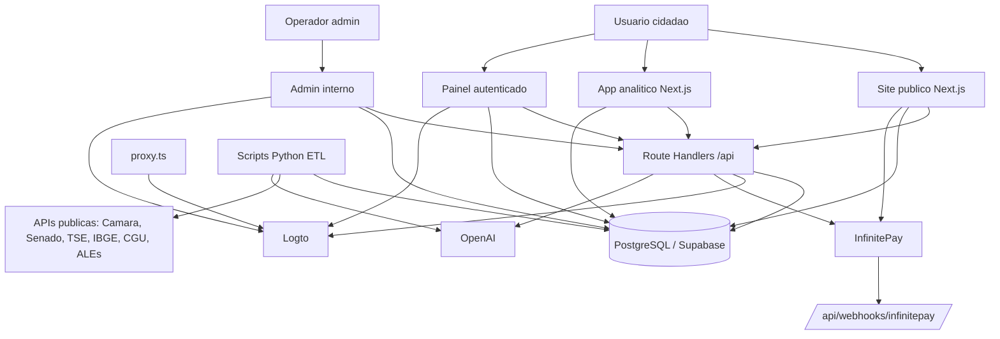
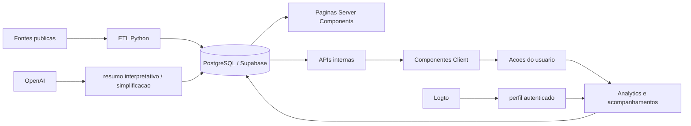
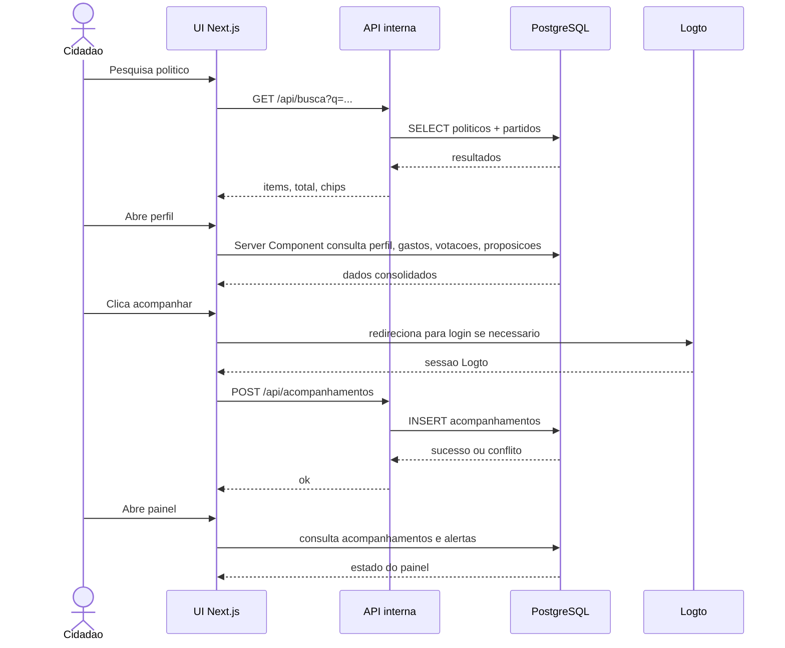

# Arquitetura

Este documento descreve a arquitetura real identificada no código do projeto Meus Politicos em 2026-06-02. A fonte de verdade e o runtime Next.js em `app/src`, os scripts ETL em `etl/`, o schema SQL documentado em `docs/DATABASE.md` e os contratos de API em `docs/API.md`.

## 1. Tipo de Aplicacao

O projeto e uma aplicacao civic-tech full-stack baseada em Next.js 16 com App Router, React 19, TypeScript, PostgreSQL/Supabase como banco relacional, Logto como provedor de identidade, InfinitePay para checkout e OpenAI para geracao/simplificacao de texto.

| Dimensao | Classificacao real | Evidencia operacional |
|---|---|---|
| Produto | Plataforma de transparencia politica com site publico, app analitico, painel do usuario e admin interno | Grupos de rota `app/src/app/(site)`, `(app)`, `(painel)`, `(admin)`, `(checkout)` |
| Renderizacao | Hibrida: Server Components, Client Components e Route Handlers | Paginas server-side consultam `pg`; componentes client chamam APIs internas e usam estado local |
| Backend | Route Handlers Next.js + Server Actions | `app/src/app/api/**/route.ts`; `app/src/actions/resumo-interpretativo.ts` |
| Banco | PostgreSQL direto via `pg`, com modelagem Supabase/PostgreSQL | Uso recorrente de `new Pool()` com `POSTGRES_*`; docs e schema apontam Supabase/PostgreSQL |
| Autenticacao | Logto server-side e edge | `app/src/lib/logto/*`, `app/src/app/api/auth/logto/*`, `app/src/proxy.ts` |
| RBAC | Role persistida em `perfis.role` | `app/src/lib/auth/current-user.ts`, endpoints admin |
| Pagamentos | InfinitePay checkout link + webhook incompleto | `/api/apoio/criar-link`, `/api/apoio/verificar-pagamento`, `/api/webhooks/infinitepay` |
| IA | OpenAI server-side com cache em tabela de resumo | `app/src/actions/resumo-interpretativo.ts`, `etl/ia/simplificar_proposicoes.py` |
| ETL | Scripts Python externos ao runtime web | `etl/camara`, `etl/senado`, `etl/tse`, `etl/ibge`, `etl/portal_transparencia`, `etl/ale` |
| Estado global | Nao ha store global identificada | `useState`, `useEffect`, `useMemo`, `useTransition`; sem Zustand/Redux/SWR/TanStack Query |

## 2. Visao de Ecossistema

O sistema se organiza em quatro superficies de usuario:

| Superficie | Grupo de rotas | Objetivo | Status |
|---|---|---|---|
| Site publico | `app/src/app/(site)` | Descoberta, paginas de estado, partidos, glossario, apoio e conteudo civico | Parcialmente produtivo |
| App analitico | `app/src/app/(app)` | Busca, comparacao, perfis, proposicoes e telas de exploracao | MVP funcional com lacunas |
| Painel do usuario | `app/src/app/(painel)` | Acompanhamentos, feed civico e area autenticada | Parcial; feed ainda usa mock/local state |
| Admin | `app/src/app/(admin)` | Edicao de politicos, feature flags, analytics, usuarios, ETL | Funcional limitado; ETL nao dispara jobs |

## 3. Diagrama Geral de Camadas



## 4. Fluxo de Dados do Ecossistema

O ciclo de dados e dividido em ingestao, modelagem relacional, entrega de produto e telemetria.



### 4.1 Ingestao

| Origem | Scripts | Saida esperada | Status arquitetural |
|---|---|---|---|
| Camara dos Deputados | `etl/camara/*` | Deputados, gastos, votacoes, proposicoes, tramitacoes | Existe, fora do runtime web |
| Senado | `etl/senado/*` | Senadores, gastos, votacoes | Existe, fora do runtime web |
| TSE | `etl/tse/*` | Eleitos 2022, candidatos 2026 | Existe; produto 2026 ainda incompleto |
| IBGE | `etl/ibge/*` | Estados e municipios | Existe |
| Portal da Transparencia/CGU | `etl/portal_transparencia/*` | Emendas e codigos SIAFI | Existe |
| ALEs | `etl/ale/*` | Assembleias estaduais | Existe; cobertura depende de fonte |
| OpenAI ETL | `etl/ia/simplificar_proposicoes.py` | Textos simplificados | Existe, exige `OPENAI_API_KEY` |

### 4.2 Persistencia

O backend acessa o banco diretamente via `pg`, sem camada Prisma/Drizzle. A aplicacao depende de variaveis `POSTGRES_HOST`, `POSTGRES_PORT`, `POSTGRES_DB`, `POSTGRES_USER` e `POSTGRES_PASSWORD`. Parte dos scripts ETL aceita fallback `SUPABASE_DB_*`, mas o runtime web usa majoritariamente `POSTGRES_*`.

### 4.3 Entrega

| Canal | Padrao predominante | Exemplo |
|---|---|---|
| Paginas publicas | Server Component consulta PostgreSQL direto e entrega HTML | `app/src/app/(site)/page.tsx` |
| Busca | Client Component chama Route Handler | `BuscaClient.tsx` -> `/api/busca` |
| Perfil politico | Pagina server-side monta dados, componente client troca abas/modo | `app/src/app/(app)/politicos/[id]/page.tsx`, `PerfilApp.tsx` |
| Acompanhamento | Botao client chama API autenticada | `BotaoAcompanhar.tsx` -> `/api/acompanhamentos` |
| Admin | Paginas server-side consultam banco; componentes client fazem PATCH/POST | `FeatureFlagList.tsx`, `PoliticoEditorSection.tsx`, `EtlSourceCard.tsx` |

## 5. Core Loop Obrigatorio

O MVP real identificado e: buscar politico, abrir perfil, acompanhar e receber/consultar feed civico. O loop existe parcialmente: busca e acompanhamento persistem, mas o feed civico ainda nao esta conectado a um pipeline real completo.



### 5.1 Pontos Solidos do Loop

| Etapa | Status | Evidencia |
|---|---|---|
| Busca por nome/filtro | Funcional | `app/src/components/busca/BuscaClient.tsx`, `app/src/app/api/busca/route.ts` |
| Perfil politico | Funcional parcial | `app/src/app/(app)/politicos/[id]/page.tsx`, `PerfilApp.tsx` |
| Acompanhar politico | Funcional autenticado | `BotaoAcompanhar.tsx`, `/api/acompanhamentos` |
| Painel autenticado | Parcial | `app/src/app/(painel)/(dashboard)/painel/page.tsx` |
| Feed civico | Bloqueado para producao plena | `app/src/components/painel/FeedCivico.tsx` ainda usa estado/mock local |

### 5.2 Fraturas do Loop

| Fratura | Impacto | Arquivos |
|---|---|---|
| Feed civico nao deriva de eventos reais completos | O usuario acompanha, mas nao recebe uma linha do tempo civica confiavel | `app/src/components/painel/FeedCivico.tsx` |
| Admin ETL nao dispara scripts | Dados podem ficar desatualizados apesar do painel exibir acao de ETL | `app/src/app/api/admin/etl/run/route.ts`, `app/src/components/admin/EtlSourceCard.tsx` |
| InfinitePay nao persiste confirmacao | Apoio financeiro pode ser criado, mas o estado confirmado nao entra no banco pelo webhook | `app/src/app/api/webhooks/infinitepay/route.ts` |

## 6. Gerenciamento de Estado

Nao ha biblioteca de estado global identificada. O estado e distribuido por:

| Categoria | Implementacao | Exemplos |
|---|---|---|
| Estado local de UI | `useState`, `useMemo`, `useEffect`, `useTransition` | Busca, tabs de perfil, sidebar, formularios, admin |
| Estado remoto | Fetch client-side para APIs internas | `/api/busca`, `/api/acompanhamentos`, `/api/admin/*` |
| Estado autenticado | Sessao Logto server-side/edge + perfil PostgreSQL | `getLogtoSession()`, `getCurrentUser()` |
| Estado persistente | PostgreSQL | `acompanhamentos`, `perfis`, `analytics_eventos`, tabelas civicas |
| Estado de pagamento | Link InfinitePay e payload webhook | Falta persistencia do webhook |
| Estado de IA | Cache/resultado em banco e limite diario por usuario | `resumo-interpretativo.ts` |

### 6.1 Consequencias Tecnicas

| Decisao atual | Beneficio | Risco |
|---|---|---|
| Sem store global | Menor complexidade inicial | Duplicacao de fetch, estado e tratamento de erro |
| Sem SWR/TanStack Query | Menos dependencias | Ausencia de cache client, retry, invalidacao e deduplicacao |
| Server Components com `pg` direto | Simplicidade para paginas de dados | Repeticao de pools e acoplamento forte ao banco |
| APIs internas para interacoes | Contratos claros para mutate/search | Alguns contratos divergem dos consumidores (`limite`, `porPagina`) |

## 7. Autenticacao e Barreiras

```mermaid
flowchart TD
  R[Request] --> P[proxy.ts]
  P --> H{Host}
  H -->|painel.*| PAINEL{Rota auth?}
  PAINEL -->|sim| ALLOW1[Permite login/cadastro/callback]
  PAINEL -->|nao| SESSAO{Sessao Logto?}
  SESSAO -->|nao| LOGIN[Redirect /login ou 401 API]
  SESSAO -->|sim| DASH[Permite painel]

  H -->|app.*| APPHOST[Rewrites /busca -> /app-busca, / -> /home]
  H -->|site principal| SITE[Site publico]

  DASH --> APIADMIN[/api/admin/*]
  APIADMIN --> USER[getCurrentUser]
  USER --> ROLE{role admin?}
  ROLE -->|sim| ADMINOK[Executa mutacao]
  ROLE -->|nao| FORBID[403]
```

O proxy protege o host do painel, mas o RBAC de admin e aplicado nos endpoints e paginas por `getCurrentUser()` e `role === 'admin'`. A documentacao detalhada esta em `docs/AUTH.md`.

## 8. APIs e Contratos

O backend HTTP identificado possui 18 endpoints, documentados em `docs/API.md`:

| Familia | Endpoints | Papel |
|---|---:|---|
| Auth Logto | 5 | Login, cadastro, reset, callback, logout |
| Busca/glossario/analytics | 3 | Produto publico e telemetria |
| Acompanhamentos | 2 | Core loop autenticado |
| Apoio/InfinitePay | 3 | Criacao de checkout, verificacao e webhook |
| Admin | 4 | Flags, politicos, emendas, ETL |
| Total mapeado | 18 | Superficie backend atual |

## 9. Observabilidade

| Camada | Estado atual | Risco |
|---|---|---|
| Logs runtime | `console.error`/`console.log` em handlers especificos | Sem correlacao, sem tracing |
| Analytics produto | `/api/analytics` insere eventos best-effort | Sem contrato forte de schema/payload |
| Admin logs | Mutacoes admin inserem `admin_logs` em alguns endpoints | Parcial, sem auditoria centralizada |
| ETL logs | Scripts Python usam logging local | Sem orquestrador e sem status central |
| Pagamentos | Logs no webhook InfinitePay | Sem persistencia e sem assinatura verificada |

## 10. Riscos Arquiteturais Prioritarios

| Prioridade | Risco | Impacto | Acao tecnica recomendada |
|---|---|---|---|
| P0 | Chave privada aparente em `docs/meuspoliticos_master.md` | Exposicao de segredo | Revogar chave, remover valor do repo e auditar historico Git |
| P0/P1 | Webhook InfinitePay nao persiste doacao | Perda de confirmacao financeira | Implementar tabela/servico de doacoes, idempotencia e validacao de origem |
| P1 | ETL admin nao executa scripts | Dados civicos desatualizados | Criar job runner/orquestrador e status persistente por fonte |
| P1 | Uso direto e repetido de `new Pool()` | Duplicacao e risco operacional | Centralizar factory de DB e politica de timeout |
| P1 | Contratos de busca divergentes | UI envia params ignorados | Normalizar `limite`/`porPagina`/`pagina` |
| P2 | Ausencia de cache client estruturado | UX instavel em fetches recorrentes | Avaliar cache/retry/invalidacao nas superficies com busca/admin |

## 11. Resumo Executivo

A arquitetura atual e coerente para um MVP civic-tech: Next.js concentra produto e backend, PostgreSQL armazena o dominio, Logto autentica e o ETL Python alimenta dados publicos. O principal problema nao e conceitual; e de consolidacao operacional. Os pontos que impedem producao robusta sao persistencia financeira incompleta, acionamento real do ETL ausente, segredo exposto em doc legado e repeticao de acesso direto ao banco sem camada compartilhada de confiabilidade.
