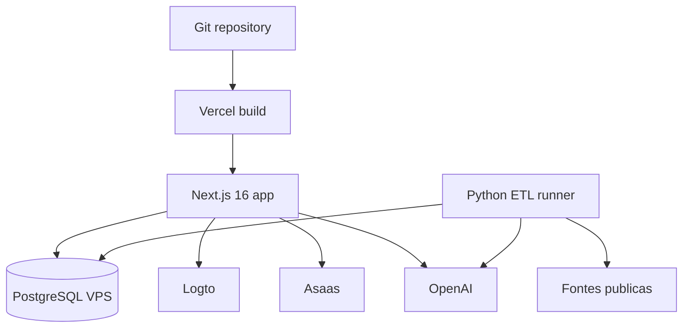
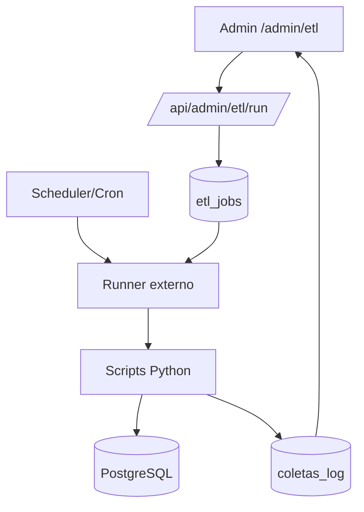

# Deployment

Este documento consolida o modelo operacional revisado em 2026-06-12. A aplicacao web roda como Next.js 16 na Vercel; o banco e PostgreSQL (VPS) acessado por `pg`; autenticacao usa Logto; pagamentos usam Asaas; rotinas de dados ficam em scripts Python fora do runtime web.

## 1. Topologia de Producao

| Camada | Provedor/ambiente | Status | Observacao |
|---|---|---|---|
| Frontend/backend web | Vercel | Alvo operacional documentado | Next.js App Router com Route Handlers |
| Banco relacional | PostgreSQL (VPS) | Ativo | Runtime usa `POSTGRES_*`; ETL aceita `SUPABASE_DB_*` apenas como fallback legado |
| Identidade | Logto | Ativo | Sessao server-side/edge e RBAC por `perfis.role` |
| Pagamentos | Asaas | Ativo condicionado | Pix/cartao e webhook implementados; exige segredos e migration |
| IA | OpenAI | Ativo condicionado | Server Action e ETL IA exigem `OPENAI_API_KEY` |
| ETL | Python local/remoto | Manual/pendente de orquestracao | Admin registra pedido, mas nao dispara scripts |
| DNS/CDN | A configurar por dominio | Dependente de projeto | URLs em `NEXT_PUBLIC_*` precisam casar com dominios reais |



## 2. Configuracao Vercel

O arquivo [vercel.json](../vercel.json) define:

| Campo | Valor | Impacto |
|---|---|---|
| `framework` | `nextjs` | Vercel detecta build Next.js |
| `outputDirectory` | `app/.next` | Build fica dentro do workspace `app` |
| `buildCommand` | `cd app && npm run build` | Executa `next build` a partir do workspace app |
| `installCommand` | `cd app && npm ci --include=optional && npm i --no-save ...` | Instala dependencias e binarios nativos Tailwind/Lightning CSS para Linux |

### 2.1 Install Command

```bash
cd app && npm ci --include=optional && npm i --no-save @tailwindcss/oxide-linux-x64-gnu @tailwindcss/oxide-linux-x64-musl lightningcss-linux-x64-gnu lightningcss-linux-x64-musl
```

Motivo operacional: Tailwind CSS v4 depende de binarios nativos. O projeto declara `optionalDependencies` linux no `app/package.json`, e o `installCommand` reforca a instalacao para ambiente Linux da Vercel.

### 2.2 Build Command

```bash
cd app && npm run build
```

Resolve para:

```bash
next build
```

### 2.3 Output

```text
app/.next
```

Nao ha build artefatual separado para ETL. Os scripts Python nao entram no deploy web da Vercel.

## 3. Scripts do Monorepo

### 3.1 Raiz

| Script | Comando | Uso operacional |
|---|---|---|
| `npm run dev` | `npm --prefix app run dev` | Desenvolvimento local no workspace `app` |
| `npm run build` | `npm --prefix app run build` | Build de producao local/CI |
| `npm run start` | `npm --prefix app run start` | Servir build local apos `next build` |
| `npm run lint` | `npm --prefix app run lint` | ESLint |

### 3.2 Workspace `app`

| Script | Comando | Uso operacional |
|---|---|---|
| `npm run dev` | `next dev` | Dev server |
| `npm run build` | `next build` | Build Next.js 16 |
| `npm run start` | `next start` | Runtime local de producao |
| `npm run lint` | `eslint` | Lint da aplicacao |
| `npm run typecheck` | `tsc --noEmit` | Verificacao TypeScript |
| `npm run test:e2e` | `playwright test` | Testes E2E e responsivos |

## 4. Comandos de Build e Validacao

| Objetivo | Comando | Pre-requisitos | Observacao |
|---|---|---|---|
| Instalar dependencias da app | `cd app && npm ci --include=optional` | `package-lock.json`/`app/package-lock.json` coerentes | Usado pela Vercel com reforco de binarios |
| Build local pela raiz | `npm run build` | Variaveis obrigatorias presentes | Encaminha para `app` |
| Build local direto | `cd app && npm run build` | `LOGTO_*`, `POSTGRES_*` conforme paginas avaliadas | Pode falhar se env obrigatoria ausente |
| Lint pela raiz | `npm run lint` | Dependencias instaladas | Encaminha para `app` |
| Start local | `npm run start` | Build gerado | Nao inicia ETL |

## 5. Variaveis Obrigatorias no Deploy

As variaveis detalhadas estao em `docs/ENVIRONMENT.md`. Para deploy web minimo:

| Familia | Variaveis | Obrigatoriedade |
|---|---|---|
| PostgreSQL | `POSTGRES_HOST`, `POSTGRES_PORT`, `POSTGRES_DB`, `POSTGRES_USER`, `POSTGRES_PASSWORD` | Obrigatorio para paginas e APIs com dados |
| Logto | `LOGTO_ENDPOINT`, `LOGTO_APP_ID`, `LOGTO_APP_SECRET`, `LOGTO_COOKIE_SECRET`, `LOGTO_BASE_URL` | Obrigatorio para auth |
| URLs publicas | `NEXT_PUBLIC_SITE_URL`, `NEXT_PUBLIC_APP_URL`, `NEXT_PUBLIC_PAINEL_URL` | Obrigatorio para redirects/callbacks |
| Asaas | `ASAAS_API_KEY`, `ASAAS_API_URL`, `ASAAS_WEBHOOK_TOKEN` | Obrigatorio para `/apoio` e webhook |
| InfinitePay legado | `INFINITEPAY_HANDLE` | Somente enquanto o webhook legado estiver ativo |
| OpenAI | `OPENAI_API_KEY`, `IA_RESUMO_MAX_GERACOES_DIA` | Obrigatorio para IA; limite recomendado |
| Email | `RESEND_API_KEY`, `RESEND_FROM` | Nao consumido no runtime mapeado; se reativado, tratar como segredo critico |

## 6. Hospedagem Multi-host

O runtime diferencia dominios pelo `proxy.ts`:

| Host | Comportamento |
|---|---|
| `painel.*` | Protege rotas autenticadas; permite `/login`, `/cadastro`, `/recuperar-senha`, `/auth`, `/api/auth/logto` |
| `app.*` | Reescreve `/` para `/home`; reescreve `/busca` para `/app-busca`; `/login` redireciona para painel |
| dominio principal | Site publico; em producao `/login` redireciona para `NEXT_PUBLIC_PAINEL_URL/login` |

Checklist de Vercel/domains:

| Item | Status esperado |
|---|---|
| `meuspoliticos.com.br` apontado para Vercel | Obrigatorio |
| `app.meuspoliticos.com.br` apontado para Vercel | Obrigatorio para app host |
| `painel.meuspoliticos.com.br` apontado para Vercel | Obrigatorio para painel |
| Redirect URIs Logto atualizadas | Obrigatorio |
| `NEXT_PUBLIC_*` coerentes com dominios reais | Obrigatorio |

## 7. Banco e Migrations

Nao foi identificado Prisma ou Drizzle. O projeto usa SQL/PostgreSQL direto. A documentacao de schema esta em `docs/DATABASE.md`; scripts e migrations historicas aparecem em `docs/migrations`.

| Operacao | Estado atual |
|---|---|
| Criacao/alteracao de schema | SQL/manual/documentada, nao centralizada em ORM |
| Conexao web | `pg` com `new Pool()` em muitos arquivos |
| Conexao ETL | `psycopg` em scripts Python |
| Pre-flight local/dev | Deve abortar apos 5s e nao tocar ambiente remoto desconhecido |
| Usuario DB | Defaults frequentes para `postgres`; recomendado criar usuario de menor privilegio |

## 8. Orquestracao ETL

### 8.1 Estado Atual

O admin tem tela de ETL e endpoint de acionamento, mas o endpoint nao executa scripts. Ele registra um log/solicitacao e retorna mensagem de trigger manual pendente.

| Componente | Arquivo | Status |
|---|---|---|
| UI ETL | `app/src/app/(admin)/admin/etl/page.tsx` | Lista fontes/status |
| Card de fonte | `app/src/components/admin/EtlSourceCard.tsx` | Chama `/api/admin/etl/run` |
| API de trigger | `app/src/app/api/admin/etl/run/route.ts` | Nao executa Python; registra intencao |
| Scripts reais | `etl/**` | Executaveis fora do runtime web |

### 8.2 Rotinas ETL Mapeadas

| Familia | Scripts | Variaveis | Frequencia recomendada |
|---|---|---|---|
| Camara | `etl/camara/collect_deputados.py`, `collect_camara_gastos.py`, `collect_votacoes.py`, `collect_proposicoes.py`, `collect_tramitacoes.py`, `link_votacoes_proposicoes.py` | `POSTGRES_*` ou `SUPABASE_DB_*` | Diario/semanal conforme fonte |
| Senado | `etl/senado/collect_senadores.py`, `collect_senado_gastos.py`, `collect_senado_votacoes.py` | `POSTGRES_*` ou `SUPABASE_DB_*` | Diario/semanal |
| TSE | `etl/tse/collect_eleitos_2022.py`, `collect_candidatos_2026.py` | `POSTGRES_*` ou `SUPABASE_DB_*` | Sob demanda/ciclo eleitoral |
| IBGE | `etl/ibge/collect_estados_ibge.py`, `collect_municipios.py` | `POSTGRES_*` ou `SUPABASE_DB_*` | Baixa frequencia |
| Portal Transparencia | `etl/portal_transparencia/collect_emendas.py`, `populate_siafi.py` | `POSTGRES_*`, `PORTAL_TRANSPARENCIA_API_KEY` | Diario/semanal |
| ALEs | `etl/ale/*` | `POSTGRES_*` ou `SUPABASE_DB_*` | Semanal/sob demanda |
| IA | `etl/ia/simplificar_proposicoes.py` | `POSTGRES_*`, `OPENAI_API_KEY` | Apos coleta de proposicoes |

### 8.3 Modelo Recomendado de Orquestracao



Requisitos minimos:

1. Criar tabela de jobs ou confirmar tabela existente para fila/status.
2. Persistir `fonte`, `status`, `started_at`, `finished_at`, `exit_code`, `stdout/stderr` resumido e usuario admin.
3. Executar scripts fora da Vercel, em runner com acesso controlado ao banco.
4. Expor somente status e logs sanitizados no admin.
5. Aplicar timeout por fonte e lock para impedir execucoes concorrentes.

## 9. Servicos Dependentes

| Servico | Necessario para build? | Necessario para runtime? | Falha esperada se indisponivel |
|---|---|---|---|
| PostgreSQL | Pode afetar build se paginas forem avaliadas dinamicamente | Sim | Paginas/APIs de dados falham |
| Logto | Sim, se config for avaliada | Sim para auth | Erro por env obrigatoria ou login indisponivel |
| Asaas | Nao | Sim para apoio | APIs retornam `503` quando nao configuradas |
| OpenAI | Nao para build geral | Sim para IA | Resumo/simplificacao indisponivel |
| Fontes publicas ETL | Nao | Nao para web imediato | Dados ficam desatualizados |

## 10. Checklist de Deploy

### 10.1 Antes do primeiro deploy

| Passo | Status esperado |
|---|---|
| Configurar dominios na Vercel | Feito |
| Configurar `NEXT_PUBLIC_*` por ambiente | Feito |
| Configurar `LOGTO_*` e callbacks no tenant | Feito |
| Configurar `POSTGRES_*` com usuario de menor privilegio | Feito |
| Aplicar migration `20260603000000_create_doacoes.sql` | Feito |
| Configurar `ASAAS_API_KEY`, `ASAAS_API_URL` e `ASAAS_WEBHOOK_TOKEN` | Feito |
| Configurar `OPENAI_API_KEY` se IA estiver ativa | Feito |
| Revogar/remover chave Resend vazada antes de deploy publico | Obrigatorio/P0 |

### 10.2 Antes de promover mudanca

| Passo | Comando/validacao |
|---|---|
| Instalar dependencias | `cd app && npm ci --include=optional` |
| Lint | `npm run lint` |
| Typecheck | `npm run typecheck` |
| E2E | `npm run test:e2e` |
| Build | `npm run build` |
| Validar auth | Login, callback, logout, painel |
| Validar core loop | Busca -> perfil -> acompanhar -> painel |
| Validar apoio | Criar Pix/cartao Asaas e confirmar webhook em sandbox |
| Validar admin | Acesso admin e bloqueio para usuario comum |

## 11. Riscos de Deploy

| Prioridade | Risco | Mitigacao |
|---|---|---|
| P0 | Chave Resend real aparente em doc versionado | Revogar e remover antes de publicar |
| P1 | Segredos/migration Asaas ausentes | Fazer pre-flight e teste sandbox antes de liberar apoio |
| P1 | ETL sem orquestracao | Criar runner externo e tabela de jobs |
| P1 | `new Pool()` duplicado sem timeout central | Centralizar conexao e aplicar timeout/SSL |
| P1 | Variaveis obrigatorias Logto ausentes quebram runtime | Checklist de env por ambiente |
| P2 | Binarios Tailwind/Lightning em Vercel | Manter `installCommand` sincronizado com `optionalDependencies` |
