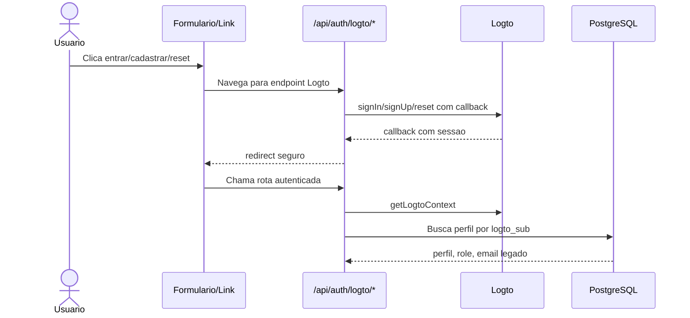
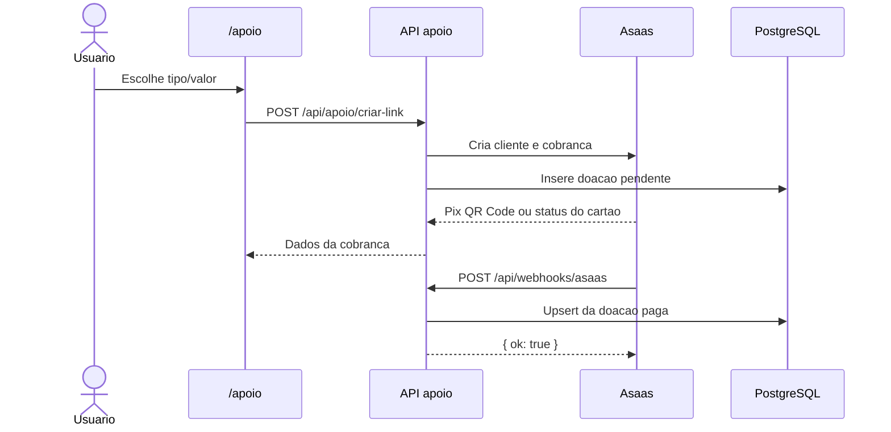
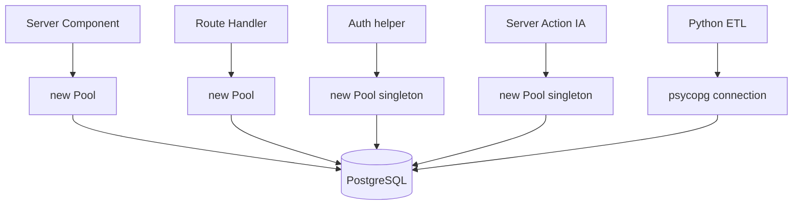
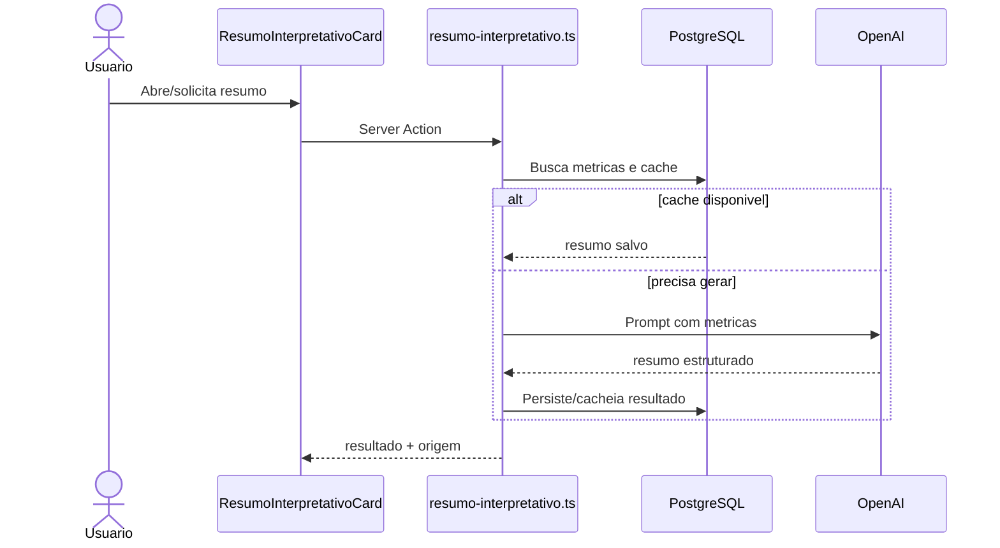

# Integracoes

Este e o manual mestre das integracoes externas identificadas no runtime e nos scripts do projeto. Estado revisado em 2026-06-12: Logto, Asaas, PostgreSQL (VPS) e OpenAI sao as integracoes principais. InfinitePay permanece apenas como webhook legado compativel.

## 1. Matriz Executiva

| Servico | Papel no produto | Arquivos fontes de consumo | Variaveis associadas | Status |
|---|---|---|---|---|
| Logto | Identidade, login, cadastro, reset, logout e sessao | `app/src/lib/logto/*`, `app/src/lib/auth/*`, `app/src/app/api/auth/logto/*`, `app/src/proxy.ts` | `LOGTO_ENDPOINT`, `LOGTO_APP_ID`, `LOGTO_APP_SECRET`, `LOGTO_COOKIE_SECRET`, `LOGTO_BASE_URL`, `NEXT_PUBLIC_APP_URL`, `NEXT_PUBLIC_SITE_URL`, `NEXT_PUBLIC_PAINEL_URL` | Ativo |
| Asaas | Cobranca Pix/cartao, consulta e webhook financeiro | `app/src/app/api/apoio/criar-link/route.ts`, `app/src/app/api/apoio/verificar-pagamento/route.ts`, `app/src/app/api/webhooks/asaas/route.ts`, `app/src/app/(site)/apoio/page.tsx` | `ASAAS_API_KEY`, `ASAAS_API_URL`, `ASAAS_WEBHOOK_TOKEN` | Ativo; depende de credenciais e migration `doacoes` |
| InfinitePay | Compatibilidade de webhook financeiro legado | `app/src/app/api/webhooks/infinitepay/route.ts` | `INFINITEPAY_HANDLE` | Legado; valida por back-channel e persiste idempotentemente |
| PostgreSQL (VPS) | Banco relacional principal | `app/src/app/**`, `app/src/app/api/**`, `app/src/lib/auth/profile-linking.ts`, `app/src/actions/resumo-interpretativo.ts`, `etl/**` | `POSTGRES_*` | Ativo |
| OpenAI | Resumo interpretativo e simplificacao de texto | `app/src/actions/resumo-interpretativo.ts`, `etl/ia/simplificar_proposicoes.py` | `OPENAI_API_KEY`, `IA_RESUMO_MAX_GERACOES_DIA` | Ativo condicionado a chave |

## 2. Logto

### 2.1 Papel

Logto e o provedor de identidade atual. Ele substitui o papel de autenticacao direta do Supabase Auth no runtime mapeado. O produto usa Logto para autenticar o usuario e usa PostgreSQL para resolver o perfil operacional, role e vinculo com o legado.

### 2.2 Arquivos Fonte

| Arquivo | Responsabilidade |
|---|---|
| `app/src/lib/logto/config.ts` | Monta config Logto e exige variaveis obrigatorias |
| `app/src/lib/logto/session.ts` | Obtem contexto Logto server-side com `fetchUserInfo: true` |
| `app/src/lib/logto/user.ts` | Converte claims Logto em `CurrentUser` preliminar |
| `app/src/lib/auth/current-user.ts` | Reconciliacao Logto -> `perfis`, checagem admin |
| `app/src/lib/auth/profile-linking.ts` | Consulta `perfis.logto_sub`, tenta link por email legado em `auth.users` |
| `app/src/lib/auth/proxy-session.ts` | Sessao Logto no Edge/Proxy |
| `app/src/proxy.ts` | Barreiras por host e redirect de painel |
| `app/src/app/api/auth/logto/sign-in/route.ts` | Inicia login |
| `app/src/app/api/auth/logto/sign-up/route.ts` | Inicia cadastro |
| `app/src/app/api/auth/logto/reset-password/route.ts` | Inicia reset de senha |
| `app/src/app/api/auth/logto/callback/route.ts` | Trata callback |
| `app/src/app/api/auth/logto/sign-out/route.ts` | Encerra sessao |
| `app/src/components/auth/LoginForm.tsx` | Redireciona para login Logto |
| `app/src/components/auth/CadastroForm.tsx` | Redireciona para cadastro Logto |
| `app/src/components/auth/RecuperarSenhaForm.tsx` | Redireciona para reset Logto |
| `app/src/components/meus-politicos/BotaoSair.tsx` | Redireciona para logout |

### 2.3 Variaveis

| Variavel | Obrigatoria | Uso |
|---|---|---|
| `LOGTO_ENDPOINT` | Sim | Endpoint do tenant |
| `LOGTO_APP_ID` | Sim | Client/app id |
| `LOGTO_APP_SECRET` | Sim | Secret server-side |
| `LOGTO_COOKIE_SECRET` | Sim | Criptografia de sessao/cookie |
| `LOGTO_BASE_URL` | Recomendado | Base URL preferencial do SDK |
| `NEXT_PUBLIC_APP_URL` | Fallback | Base URL alternativa |
| `NEXT_PUBLIC_SITE_URL` | Fallback | Base URL alternativa e origem publica |
| `NEXT_PUBLIC_PAINEL_URL` | Sim em producao | Redirects para painel/login |

### 2.4 Fluxo Operacional

### 2.5 Gaps e Cuidados

| Item | Status | Acao |
|---|---|---|
| Reconciliacao `perfis.logto_sub` | Implementada | Validar massa migrada |
| Fallback por email legado em `auth.users` | Implementado | Depende da tabela legacy existir e conter email |
| RBAC admin | Implementado nos endpoints admin | Centralizar guard compartilhado reduziria duplicacao |
| Redirect URIs | Dependem de env/provider | Validar em cada ambiente |
| Segredos Logto no client | Nao identificado | Manter sem prefixo `NEXT_PUBLIC_` |

## 3. Pagamentos

### 3.1 Papel

Asaas e a integracao ativa para apoio financeiro. O backend cria cliente e cobranca Pix ou cartao, persiste a doacao pendente e confirma o pagamento por consulta ou webhook autenticado. InfinitePay nao cria novos checkouts; seu webhook foi mantido para compatibilidade com transacoes legadas.

### 3.2 Arquivos Fonte

| Arquivo | Responsabilidade |
|---|---|
| `app/src/app/(site)/apoio/page.tsx` | UI de apoio; chama `/api/apoio/criar-link` |
| `app/src/app/(checkout)/apoio/confirmacao/page.tsx` | Tela de confirmacao pos-pagamento |
| `app/src/app/api/apoio/criar-link/route.ts` | Cria cliente/cobranca Asaas e persiste `doacoes` |
| `app/src/app/api/apoio/verificar-pagamento/route.ts` | Consulta no Asaas apenas pagamentos previamente registrados |
| `app/src/app/api/webhooks/asaas/route.ts` | Valida token e faz upsert idempotente da confirmacao |
| `app/src/app/api/webhooks/infinitepay/route.ts` | Valida transacao legada por back-channel e faz upsert |

### 3.3 Variaveis

| Variavel | Uso |
|---|---|
| `ASAAS_API_KEY` | Credencial server-side para clientes e cobrancas |
| `ASAAS_API_URL` | Base do Asaas; default sandbox |
| `ASAAS_WEBHOOK_TOKEN` | Token obrigatorio do webhook Asaas |
| `INFINITEPAY_HANDLE` | Necessario apenas para validar webhooks legados |

### 3.4 Endpoints Externos

| Endpoint externo | Consumidor interno | Metodo |
|---|---|---|
| `${ASAAS_API_URL}/customers` | `/api/apoio/criar-link` | GET/POST |
| `${ASAAS_API_URL}/payments` | `/api/apoio/criar-link` | POST |
| `${ASAAS_API_URL}/payments/{id}` | `/api/apoio/verificar-pagamento` | GET |
| `https://api.checkout.infinitepay.io/payment_check` | `/api/webhooks/infinitepay` | POST |

### 3.5 Fluxo Operacional

### 3.6 Controles e riscos residuais

| Falha | Evidencia | Impacto |
|---|---|---|
| Token Asaas ausente | Webhook retorna `503` e nao aceita evento anonimo | Configurar `ASAAS_WEBHOOK_TOKEN` antes do go-live |
| Migration nao aplicada | Inserts/upserts em `doacoes` falham | Aplicar `db/migrations/20260603000000_create_doacoes.sql` |
| Endpoint de verificacao publico | Restrito a `transaction_nsu` existente no banco | Adicionar rate limit no edge/gateway |
| InfinitePay legado | Depende de `payment_check` e `INFINITEPAY_HANDLE` | Remover quando nao houver transacoes legadas |

### 3.7 Estado de fechamento

Persistencia, idempotencia e autenticidade do webhook ativo estao implementadas. Permanecem como tarefas operacionais aplicar a migration, configurar os segredos, testar no sandbox Asaas e adicionar rate limiting.

## 4. PostgreSQL (VPS)

### 4.1 Papel

O banco relacional e o nucleo do dominio. O runtime web acessa diretamente PostgreSQL por `pg`, usando `new Pool()` em paginas, APIs e helpers.

### 4.2 Arquivos Fonte

| Area | Arquivos/Padroes |
|---|---|
| Paginas publicas | `app/src/app/(site)/**/page.tsx` |
| App analitico | `app/src/app/(app)/**/page.tsx` |
| Painel | `app/src/app/(painel)/(dashboard)/painel/page.tsx` |
| Admin | `app/src/app/(admin)/admin/**/page.tsx` |
| APIs | `app/src/app/api/**/route.ts` |
| Auth profile | `app/src/lib/auth/profile-linking.ts` |
| IA server action | `app/src/actions/resumo-interpretativo.ts` |
| ETL | `etl/**` |

### 4.3 Variaveis

| Variavel | Runtime web | ETL | Observacao |
|---|---|---|---|
| `POSTGRES_HOST` | Sim | Sim | Principal |
| `POSTGRES_PORT` | Sim | Sim | Defaults variam entre `5432` e `5433` |
| `POSTGRES_DB` | Sim | Sim | Principal |
| `POSTGRES_USER` | Sim | Sim | Default frequente `postgres` |
| `POSTGRES_PASSWORD` | Sim | Sim | Segredo critico |
| `SUPABASE_DB_HOST` | Nao mapeado no web | Sim | Fallback em varios scripts |
| `SUPABASE_DB_PORT` | Nao mapeado no web | Sim | Fallback |
| `SUPABASE_DB_USER` | Nao mapeado no web | Sim | Fallback |
| `SUPABASE_DB_PASSWORD` | Nao mapeado no web | Sim | Fallback |
| `SUPABASE_DB_NAME` | Nao mapeado no web | Sim | Fallback |

### 4.4 Padrao Atual de Acesso

### 4.5 Gaps

| Gap | Impacto | Recomendacao |
|---|---|---|
| Pool duplicado em muitos arquivos | Dificulta timeout, SSL, retry e observabilidade | Criar modulo unico de DB |
| Defaults divergentes | Risco de ambiente errado | Padronizar porta e database |
| Usuario default `postgres` | Risco de privilegio excessivo | Criar roles por runtime/ETL/admin |
| Sem ORM/schema typed | Contratos SQL manuais | Avaliar camada typed leve ou queries centralizadas |
| ETL fora de orquestracao web | Atualizacao manual | Implementar job runner ou fila |

## 5. OpenAI

### 5.1 Papel

OpenAI e usada para transformar dados politicos em texto mais compreensivel. Existem dois consumos reais: resumo interpretativo no app e simplificacao de proposicoes no ETL.

### 5.2 Arquivos Fonte

| Arquivo | Responsabilidade |
|---|---|
| `app/src/actions/resumo-interpretativo.ts` | Gera resumo interpretativo com limite diario, cache/origem e leitura de metricas |
| `app/src/components/politico-v2/ResumoInterpretativoCard.tsx` | UI que dispara/mostra resumo |
| `etl/ia/simplificar_proposicoes.py` | Simplifica ementas de proposicoes via client Python OpenAI |

### 5.3 Variaveis

| Variavel | Uso |
|---|---|
| `OPENAI_API_KEY` | Instanciacao do client OpenAI no server e ETL |
| `IA_RESUMO_MAX_GERACOES_DIA` | Limite diario de geracoes no server action |

### 5.4 Fluxo no App

### 5.5 Riscos

| Risco | Impacto | Controle atual | Acao recomendada |
|---|---|---|---|
| Chave exposta | Custo e abuso | Nao ha exposicao client identificada | Manter server-only e rotacionar se suspeita |
| Custo sem limite | Gasto inesperado | `IA_RESUMO_MAX_GERACOES_DIA` | Confirmar default e monitoramento |
| Conteudo alucinatorio | Resumo civico incorreto | Prompt/metricas/campo origem | Adicionar citacoes/dados-fonte e revisao de prompt |
| ETL manual | Dados simplificados desatualizados | Script existe | Orquestrar execucao e logs |

## 6. Integracoes Externas Secundarias

Embora o Lote 6 priorize quatro servicos, o codigo/ETL tambem indica dependencias externas:

| Servico/Fonte | Onde aparece | Papel |
|---|---|---|
| ViaCEP | Sem consumidor ativo | Integracao removida com a descontinuacao de `/meu-estado` |
| APIs Camara | `etl/camara/*` | Deputados, votacoes, gastos, proposicoes |
| APIs Senado | `etl/senado/*` | Senadores, votacoes, gastos |
| TSE | `etl/tse/*` | Eleitos/candidatos |
| IBGE | `etl/ibge/*` | Estados/municipios |
| Portal da Transparencia | `etl/portal_transparencia/*` | Emendas/SIAFI |
| Assembleias Legislativas | `etl/ale/*` | Dados estaduais |
| Resend | `.env.example`, docs legados | Email transacional documentado, sem consumidor runtime mapeado |

## 7. Integracoes Removidas ou Historicas

| Integracao | Estado | Observacao |
|---|---|---|
| Stripe | Removida do runtime ativo mapeado | Ainda aparece em docs legados; fluxo atual usa Asaas |
| Supabase Auth como auth primario | Substituido por Logto no runtime | `auth.users` ainda participa da reconciliacao de email legado |

## 8. Ordem Recomendada de Saneamento

| Prioridade | Integracao | Acao |
|---|---|---|
| P0 | Resend/docs | Revogar chave exposta e remover valor real de `docs/meuspoliticos_master.md` |
| P1 | Asaas | Validar sandbox, migration, token e monitoramento por ambiente |
| P1 | PostgreSQL/Supabase | Centralizar factory de conexao e padronizar envs |
| P1 | ETL/public APIs | Criar acionamento real e observavel para scripts Python |
| P1 | Logto | Validar massa de `perfis.logto_sub` e redirects por ambiente |
| P2 | OpenAI | Auditar limites, logs de custo e qualidade de resposta |

## 9. Resumo de Engenharia

As integracoes centrais estao presentes, mas em niveis diferentes de maturidade. Logto esta integrado de ponta a ponta para sessao e RBAC. PostgreSQL sustenta o dominio, porem com conexoes repetidas e defaults divergentes. OpenAI esta isolada no server/ETL, com risco controlavel por limite diario. O fluxo Asaas fecha criacao e confirmacao financeira em codigo, mas ainda exige validacao operacional no sandbox e em producao.
